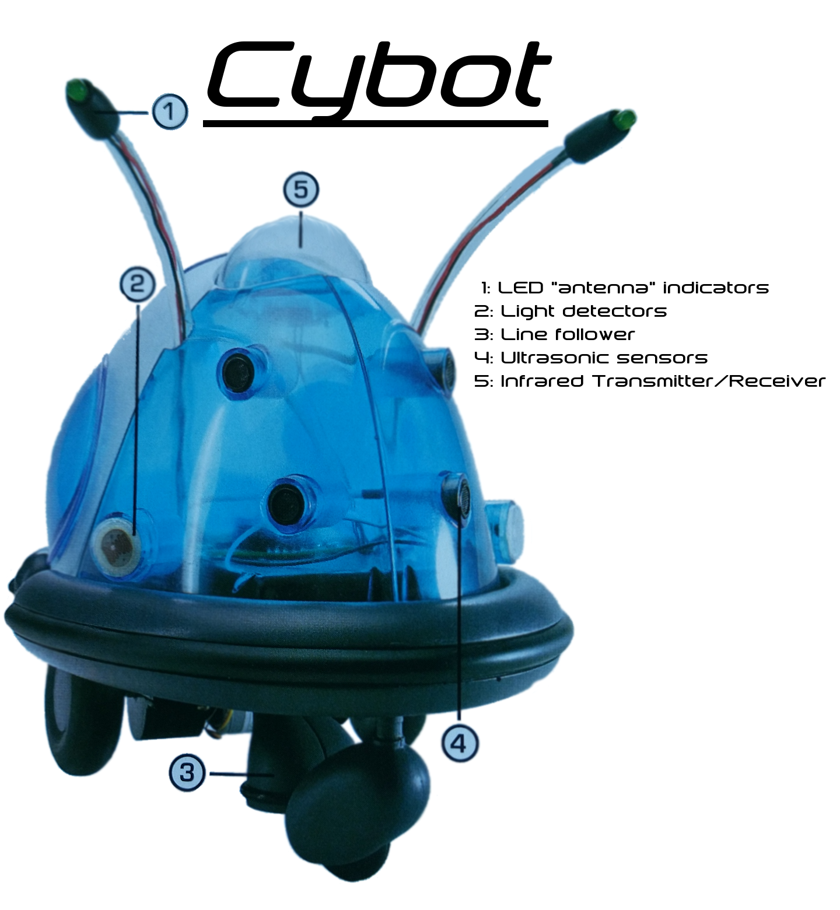
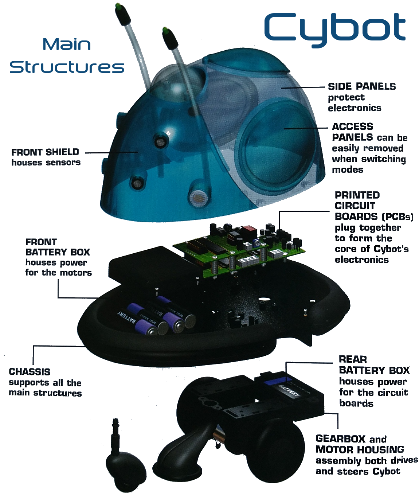

Cybot Resurrected
=================

This is a project to bring my old [Cybot] back my to life.

</img>
</img>

After I lost my remote control (it was stolen actually, by some idiot who
probably thought it was a game controller :angry: ), Cybot has just been sitting
there for quite a number of years.

A while back I built [FoamBot] which was a robot in which I used [Foam Board]
exclusively as construction material, continues servos as drive train, and an
Arduino Uno as MCU. The software for [FoamBot] was based on a simple
[co-operative multitasking] library, with all functionality built as (almost)
completely independent tasks to form a very loosely defined type of Robot
Operating System.

Due to time constraints and some waning of interest, FoamBot took a backseat.
When I now recently got the urge to build a remote controller robot again, I
decided to use as much of Cybot as possible, but replace the MCU with something
Arduino based. This is where we now begin :smile:.

Features
--------
This list will be expanded as more things are added, at a minimum, these are the
features I would like for now:

* Use as much of the Cybot sensors and hardware as possible
* Controlled via:
    - Direct serial connection - this will be more for testing and debugging,
      and will be a tethered connection.
    - Infrared - this will obviously be a remote control, it should use the
      original Cybot IR Receiver, and should be able to use any available IR
      remote (after training Cybot for the remote - see below)
    - Bluetooth - also a remote control. This will allow many mobile apps to act
      as a remote control, and will allow things like using a phone's gyro,
      accelerometer and other sensors to control the bot by simply tilting and
      moving the phone in the air.
* All input controls should have the options to be trainable in order to ensure
  the controller can issue the correct robot control commands. Trained control
  mappings should be stored in EEPROM to survive power offs.
* Obstacle avoidance using light sensors and/or ultrasonic and/or IR (using a
  separate IR sensor).
* Line follower option.

----
[Cybot]: https://en.wikipedia.org/wiki/Real_Robots
[FoamBot]: https://github.com/fitzterra/FoamBot
[Foam Board]: https://en.wikipedia.org/wiki/Foamcore
[co-operative multitasking]: https://github.com/fitzterra/Task
