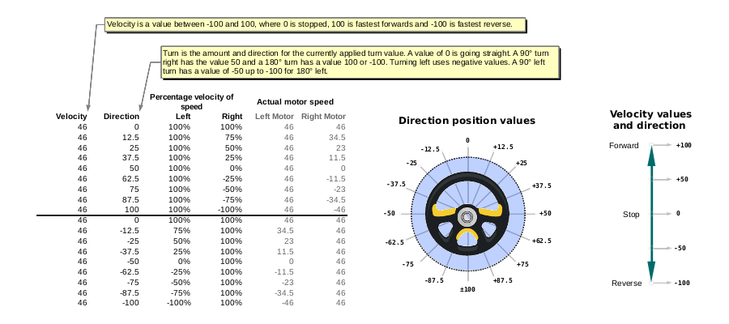

Software for Robot Control
==========================

**Table of Contents**
1. [Abstract](#abstract)
2. [Development Environment](#development-environment)
3. [Required external libraries](#required-external-libraries)
	1. [Streaming](#streaming)
	2. [Task](#task)
	3. [IRRemote](#irremote)
	4. [SoftPWM](#softpwm)
4. [Components](#components)
	1. [Configuration](#configuration)
	2. [Debugging](#debugging)
	3. [Utils](#utils)
	4. [Input Control and Robot commands](#input-control-and-robot-commands)
	5. [Drive Train and Wheels](#drive-train-and-wheels)
5. [Testing](#testing)


Abstract
--------
This is the code base for Cybot's software.

It is written for an Arduino type environment, although the Arduino IDE and
compiler is not used, and may even break if trying to compile and upload the
code as is - I have not tested, sorry :grimacing:

Development Environment
-----------------------
I can not stand the clunky Arduino IDE and prefer to use my editor of choice
which is Vim (or gVim actually) - I can not imagine using any other editor
:smile:

Although the Arduino IDE allows an external editor but still compile and upload
via the IDE, I prefer to compile/upload from the terminal or directly from
within Vim. I can even start a serial terminal from within Vim :satisfied:

Also note that I develop on Linux exclusively, so have no idea how feasible this
environment is on other platforms.

I use Sudar Muthu's [Arduino-Makefile] to build and upload to the Arduino. This
`Makefile` still needs the Arduino IDE and code base to be installed, and
requires a path to where it is installed to be hardcoded in the Makefile.

In addition to the path to the Arduino files, it also needs paths to some other
things like the original installation dir for [Arduino-Makefile], your local
Arduino libraries dir, etc.

These are currently hardcoded to where they live in my environment, so should be
changed to your environment should you try to use the `Makefile`.

Required external libraries
---------------------------
This code requires the following external libraries to be installed:

### Streaming
A very useful extension to streams that overloads the `<<` operator and allows
things like:
```
Serial << "One apple + one pear = " << (1+1) << " fruit." << endl;
```

Instead of the clunky:
```c++
Serial.print("One apple + one pear = ");
Serial.print(1+1);
Serial.println(" fruit.");
```

**Installation**: Get the library from **Mikal Harts's** site
[here][streaminglib] and install in your `libraries` directory. This has to be
done manually since it is not available via the built in Arduino library manager
as of this writing.

### Task
This is a very simple [task manager] for co-operative multitasking by **Alan
Burlison**. It allows for each sensor, motors, input control, etc. to be written
as small fast executing tasks, all independent of each other. The task manager
will then execute each of these task whenever it needs executing.

This helps decoupling the various components from each other and makes it much
easier to write and manage the control code.

**Installation**: One of these options:
* Download the tarball directly from [Alans's site][task manager] and install in
  your `libraries` directory
* If cloning a GitHub repo is easier, you can clone my [GitHub wrapper][githubTaskLib]
  for Alan's Task library in your `libraries` directory

### IRRemote
This is only needed if Infrared remote control will be used. See
[configuration](#configuration) for more details on enabling IR remote
functionality.

**Installation**: This can be installed vi the Arduino IDE Library Manager.
Search for `IRRemote` by **shirrif**.

### SoftPWM
This library provides software PWM which allows any digital pin to be used for
PWM control and not only yhe hardware PWM pins.

Configuring software PWM for speed control can be done my defining
`HBRIDGE_SOFT_PWM` in `config.h` under the *HBRIDGE_DRV_EN* section.

This should only be done if it is not possible to use have 4 hardware enabled
PWM pins for controlling the two HBridges. Software PWM is slower than hardware
PWM and also has some other limitations that might become an issue depending on
the complexity and other libraries used in the rest of the control system.

**Installation**: Clone it from **Brett Hagman's** [SoftPWM GitHub] repo into
your `libraries` directory.

Components
----------
The software consists of the following components:

### Configuration
The configuration file, **`config.h`** is used to configure all components,
hardware, optional items and everything else.

All configuration option in this file is well documented, so please read there
for details.

### Debugging
The **`debug.h`** file includes a macro that can be used to easily generate
debug output. The macro is defined to output the supplied arguments to the
serial port if `_DEBUG` is defined in `config.h`.

If `_DEBUG` is not defined, the macro has an empty definition, and does not do
anything when called.

_**ToDo**_: Optionally allow debug output via Bluetooth or even onboard display
in future.

### Utils
These files (`utils.h` and `utils.cpp`) are for general small utility functions
that do not justify their own full source files.

### Input Control and Robot commands
This component is responsible for reading various input controllers (serial, IR,
Bluetooth, etc.) and decoding this input to robot control commands.

See the [controls] documentation for more details.

### Drive Train and Wheels
A **Wheel** is modeled as an object that can be rotate forwards or backwards at a
set _speed_. The _speed_ is not a distance over time like meters/second for
example, but rather a percentage of the full power of the motor.

This means that a speed value of `50` will rotate the wheel at 50% of it's full
power. The speed can be in the range `-100` (full speed backwards) to `100`
(full speed forwards).

For Continues Rotation Servos, the _power_ is managed by setting the servo
angle, which makes the servo rotate slower or faster to try to reach the angle.
For HBridges with Brushed DC Motors, the _power_ is managed via PWM.

A **Drive Train** is modeled as two wheels of the same type, placed on the left
and right sides of the chassis. The drive train can then be told to drive at a
specific speed (again, as a percentage of full rotation speed of the wheels),
forwards or backwards, or to change to a set direction.

As for the speed value, the _direction_ value is also a percentage between
`-100` and `100`. For direction, a value of `0` means straight forward which will
turn both wheels in the same direction at the same _speed_. Directions between
`0` and `100` will make the robot turn to the left, with `50` representing the
`90°` point (east). With a direction of `50`, the right wheel is stopped while
the left wheel turns at the current _speed_.

The direction `100` represents `180°`, in which case the right wheel is turning
in _reverse_ at the current _speed_, while the left is going forward at the
current _speed_. This means the robot is spinning clockwise on the same spot.

The directions from `0` to `-100` are for turning in the left (west) direction,
with the behaviour exactly the same as for the right direction.

Note that `100` and `-100` are both `180°` spinning around the central axis,
except that the direction of spin is different.

This diagram explains the relationship between _speed_, _direction_ and the
actual wheel turning speed:



Testing
-------
See the [testing] documentation for more details


[Vim]: http://vim.org
[Arduino-Makefile]: https://github.com/sudar/Arduino-Makefile
[streaminglib]:  http://arduiniana.org/libraries/streaming/
[task manager]: http://bleaklow.com/2010/07/20/a_very_simple_arduino_task_manager.html
[githubTaskLib]: https://github.com/fitzterra/Task
[SoftPWM GitHub]: https://github.com/bhagman/SoftPWM
[controls]: ControlCommand.md
[testing]: tests/README.md
